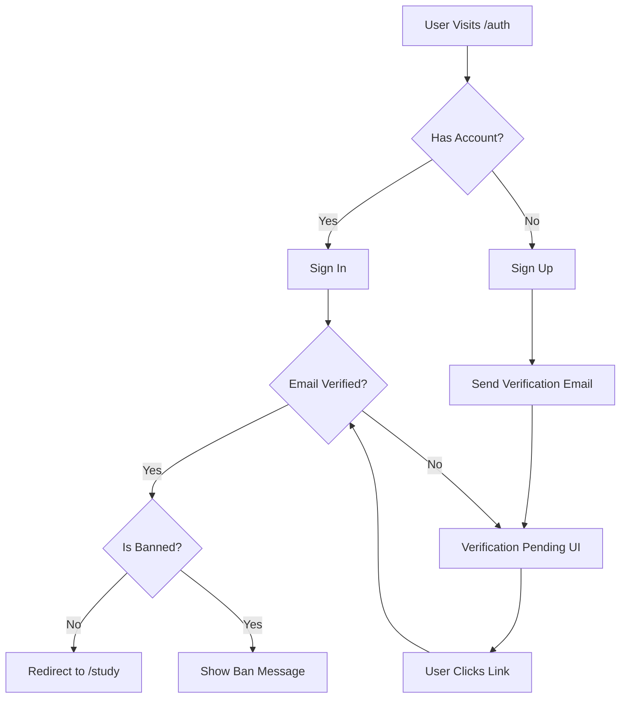

# Studyshare - Complete Feature Documentation

> **Version:** 1.0  
> **Last Updated:** January 27, 2026  
> **Platform:** Web Application (PWA-enabled)

---

## Table of Contents

1. [Overview](#overview)
2. [Authentication & Onboarding](#1-authentication--onboarding)
3. [Study Hub](#2-study-hub-study-page)
4. [Chatrooms](#3-chatrooms)
5. [Notices](#4-notices--announcements)
6. [Profile](#5-user-profile)
7. [Explore](#6-explore-students)
8. [Bookmarks](#7-bookmarks)
9. [Notifications](#8-notification-system)
10. [Department Profiles](#9-department-profiles)
11. [Sidebar & Navigation](#10-sidebar--navigation)
12. [AI Features](#11-ai-features)
13. [Permission System](#12-permission-system)

---

## Overview

**Studyshare** is a college-centric educational platform that combines resource sharing, community discussion, and academic announcements into a unified experience. The platform is designed with **college isolation** – users can only interact with content and users from their own institution.

### Core Principles
- 🏫 **College-Centric**: All content is isolated per college
- 🔒 **Permission-Based**: Full access for college email users, read-only for others
- 💬 **Community-Driven**: Reddit-like chatrooms and threaded discussions
- 📚 **Resource-Focused**: Share notes, videos, and PYQs with peer voting

---

## 1. Authentication & Onboarding

### 1.1 College Selection Page (`/`)

**Purpose:** Entry point where users select their college before authentication.

**Features:**
| Feature | Description |
|---------|-------------|
| **College List** | Searchable list of supported colleges |
| **Active Colleges** | Colleges with full functionality (e.g., KIET) |
| **Coming Soon** | Placeholder colleges showing "Work in Progress" |
| **User Count** | Shows number of registered users per college |
| **Request College** | Button to request adding a new college |

**How It Works:**
1. User searches or browses the college list
2. Active colleges show user counts (fetched from Supabase)
3. Clicking an active college stores the selection in `localStorage` and redirects to `/auth`
4. Coming soon colleges show an "Under Development" badge

**Example:**
```
┌─────────────────────────────────────┐
│ Select Your College                 │
├─────────────────────────────────────┤
│ 🔍 [Search colleges...]             │
│                                     │
│ ✅ Krishna Institute of Engineering │
│    └── 847 students                 │
│                                     │
│ ⏳ IIT Delhi (Coming Soon)          │
│ ⏳ IIT Bombay (Coming Soon)         │
└─────────────────────────────────────┘
```

---

### 1.2 Authentication Page (`/auth`)

**Purpose:** User login and registration with Firebase Authentication.

**Features:**
| Feature | Description |
|---------|-------------|
| **Google Sign-In** | One-click authentication with Google |
| **Email/Password** | Traditional email registration and login |
| **Email Verification** | Verification email sent for email/password signups |
| **Password Reset** | Forgot password flow with email link |
| **Ban Detection** | Blocked users see a "banned" message instead of access |

**Authentication Flow:**


**Example - Ban Message:**
```
┌─────────────────────────────────────┐
│ 🔒 Account Banned                   │
├─────────────────────────────────────┤
│ Your access to Studyshare has     │
│ been suspended.                     │
│                                     │
│ Reason: Violation of community      │
│ guidelines                          │
│                                     │
│ [Sign Out]                          │
└─────────────────────────────────────┘
```

---

## 2. Study Hub (`/study` Page)

### Overview
The main study page serves as the central hub for academic resources. It has three main tabs: **Resources**, **Syllabus**, and **Following**.

---

### 2.1 Resources Tab

**Purpose:** Browse, filter, and access educational materials shared by the community.

**Features:**
| Feature | Description |
|---------|-------------|
| **Resource Types** | Videos, Notes (PDFs), Previous Year Questions (PYQs) |
| **Filtering** | By branch (CSE, ECE, ME, etc.), semester (1-8), subject |
| **Sorting** | Newest, Most Upvoted, Most Viewed |
| **Search** | Real-time search across titles and descriptions |
| **Upvote/Downvote** | Reddit-style voting on resources |
| **Bookmarking** | Save resources for later access |
| **Upload** | Full-access users can upload new resources |

**Resource Card Layout:**
```
┌─────────────────────────────────────────────────┐
│ 📺 Complete Guide to Data Structures           │
│ by Rahul K. • 2 days ago                        │
├─────────────────────────────────────────────────┤
│ Learn about arrays, linked lists, trees...     │
│                                                 │
│ 🏷️ CSE | Semester 3 | Data Structures           │
├─────────────────────────────────────────────────┤
│ ⬆️ 156  ⬇️ 12  │  🔖 Bookmark  │  📤 Share     │
└─────────────────────────────────────────────────┘
```

**Uploading a Resource:**
1. Click "Upload Resource" button
2. Select type: Video (YouTube/Vimeo URL) or PDF
3. Fill metadata: Title, Branch, Semester, Subject, Description
4. For PDFs: Upload via Cloudflare Workers to storage
5. Pass reCAPTCHA verification
6. Resource appears in feed (may require admin approval)

---

### 2.2 Syllabus Tab

**Purpose:** Access and download official course syllabi.

**Features:**
| Feature | Description |
|---------|-------------|
| **PDF Viewer** | Built-in viewer for syllabus documents |
| **Download** | Direct download of syllabus PDFs |
| **Filter** | By branch and semester |
| **Admin Upload** | Only administrators can upload syllabi |

**Example:**
```
┌─────────────────────────────────────────────────┐
│ 📄 Data Structures Syllabus                     │
│ CSE • Semester 3                                │
├─────────────────────────────────────────────────┤
│ [View PDF] [Download] [Bookmark]                │
└─────────────────────────────────────────────────┘
```

---

### 2.3 Following Tab

**Purpose:** Personalized feed showing content from followed users and departments.

**Features:**
| Feature | Description |
|---------|-------------|
| **User Following** | Content from users you follow |
| **Department Following** | Notices from followed departments |
| **Real-time Updates** | New content appears via Supabase subscriptions |

---

### 2.4 Study Timer

**Purpose:** Pomodoro-style study timer integrated into the Study page.

**Features:**
- Configurable work/break intervals
- Visual countdown display
- Audio notification when timer ends
- Session statistics

---

## 3. Chatrooms

### Overview
Chatrooms function like **subreddits** – topic-specific discussion spaces where users can create posts, comment, vote, and save content. Each room has a unique join code for private access.

---

### 3.1 Chatroom List (`/chatroom`)

**Purpose:** Browse and manage chatrooms you've joined.

**Features:**
| Feature | Description |
|---------|-------------|
| **My Rooms** | List of rooms you're a member of |
| **Pin Rooms** | Pin favorite rooms to the top |
| **Room Preview** | Shows member count and privacy status |
| **Create Room** | Create new public or private rooms |
| **Join Room** | Enter a room code to join private rooms |
| **Saved Posts** | Filter to show only saved posts |

**Room List Example:**
```
┌─────────────────────────────────────┐
│ 📌 cse-2024 (145 members)           │ ← Pinned Room
│ 🔒 team-sigma (5 members) [Private] │
│ 💬 aiml-B (89 members)              │
│                                     │
│ [+ Create Room] [🔑 Join by Code]   │
└─────────────────────────────────────┘
```

---

### 3.2 Room Detail View (`/chatroom/:roomId`)

**Purpose:** View and participate in room discussions.

**Features:**
| Feature | Description |
|---------|-------------|
| **Post Feed** | Chronological list of posts (like Reddit) |
| **Create Post** | Text post with optional image attachment |
| **Upvote/Downvote** | Vote on posts (remembered per user) |
| **Comments** | Threaded comment system with nested replies |
| **Save Post** | Bookmark individual posts |
| **Share** | Copy post link or share to platforms |
| **Real-time** | New posts appear instantly via subscriptions |
| **Image Upload** | Attach images to posts (via Cloudflare Workers) |
| **Load More** | Pagination for older posts |

**Post Layout:**
```
┌─────────────────────────────────────────────────┐
│ 👤 Rahul K. • 2 hours ago                       │
├─────────────────────────────────────────────────┤
│ Does anyone have notes for the upcoming DBMS   │
│ mid-semester exam? I've been struggling with   │
│ normalization concepts.                         │
│                                                 │
│ [Image attached: dbms_notes.png]               │
├─────────────────────────────────────────────────┤
│ ⬆️ 23  ⬇️ 2  │  💬 8 comments  │  📁 Save     │
└─────────────────────────────────────────────────┘
    │
    ├── 💬 Priya M.: Check out the YouTube video...
    │   └── 💬 Rahul K.: Thanks, that helped!
    │
    └── 💬 Amit S.: I have some notes, DMing you!
```

---

### 3.3 Creating a Chatroom

**Purpose:** Create new discussion spaces.

**Flow:**
1. Click "Create Room" button
2. Enter room details:
   - **Name**: Unique room identifier (e.g., "cse-batch-2024")
   - **Description**: Brief purpose of the room
   - **Privacy**: Public (anyone can join) or Private (code required)
3. System generates a unique **Room Code** for private rooms

**Room Code System:**
- Format: 6-character alphanumeric code (e.g., `ABC123`)
- Regeneratable by room admin
- Required to join private rooms

**Example:**
```
Create New Chatroom
───────────────────
Name: [study-group-dsa    ]
Description: [DSA practice and doubt solving]
Privacy: ○ Public  ● Private
         ↳ A unique code will be generated

[Create Room]
```

---

### 3.4 Joining a Chatroom

**Methods:**
1. **Public Rooms**: Click "Join" on the room listing
2. **Private Rooms**: Enter the room code via "Join by Code" dialog

**Join by Code Flow:**
```
┌─────────────────────────────────────┐
│ Enter Room Code                     │
├─────────────────────────────────────┤
│ [      ABC123        ]              │
│                                     │
│ [Join Room]                         │
└─────────────────────────────────────┘
```

---

### 3.5 Room Settings (Admin Only)

**Purpose:** Room administrators can manage room settings.

**Admin Features:**
| Feature | Description |
|---------|-------------|
| **Regenerate Code** | Create a new join code (invalidates old) |
| **Ban Members** | Remove and block users from the room |
| **Unban Members** | Restore access to previously banned users |
| **Delete Room** | Permanently delete the room and all content |
| **View Members** | See full member list with join dates |

---

### 3.6 Voting System

**How Voting Works:**
- Each user can cast ONE vote per post (up or down)
- Clicking the same vote again removes it
- Clicking the opposite vote switches the vote
- Vote counts update in real-time for all users
- User votes are persisted and shown on subsequent visits

**Example Vote States:**
```
Initial:    ⬆️ 10  ⬇️ 2
User upvotes: ⬆️(active) 11  ⬇️ 2
User switches to downvote: ⬆️ 10  ⬇️(active) 3
User removes vote: ⬆️ 10  ⬇️ 2
```

---

### 3.7 Comment Threading

**Purpose:** Reddit-style threaded discussions on posts.

**Features:**
- **Nested Replies**: Reply to any comment, creating threads
- **Depth Indication**: Visual indentation for reply depth
- **Reply Notifications**: Get notified when someone replies to your comment
- **Delete Comments**: Remove your own comments

**Thread Structure:**
```
Post: Does anyone have DBMS notes?
│
├── 💬 Priya: I have some notes from last semester
│   ├── 💬 You: Can you share them?
│   │   └── 💬 Priya: Sure, check your DMs!
│   │
│   └── 💬 Amit: I need them too!
│
└── 💬 Vikram: Try the library database section
```

---

## 4. Notices & Announcements

### 4.1 Notices Page (`/notices`)

**Purpose:** Department-wise announcements and official communications.

**Features:**
| Feature | Description |
|---------|-------------|
| **Department Filter** | Filter by CSE, ECE, ME, CE, EEE, AIML, DS, IT |
| **Follow Departments** | Get notified of new notices from followed depts |
| **Notice Types** | Text, PDF attachments, video, images |
| **Priority Levels** | Normal, Important, Urgent (visual indicators) |
| **Comments** | Threaded discussion on notices |
| **Bookmark** | Save notices for later reference |
| **Like** | React to notices |

**Notice Layout:**
```
┌─────────────────────────────────────────────────┐
│ 🏷️ CSE Department                               │
│ 📢 URGENT                                       │
├─────────────────────────────────────────────────┤
│ Mid-Semester Exam Schedule Released             │
│ The examination schedule for Semester 3 has    │
│ been uploaded. Please check the attached PDF.   │
│                                                 │
│ 📎 [exam_schedule.pdf] [View] [Download]        │
├─────────────────────────────────────────────────┤
│ ❤️ 45 likes │ 💬 12 comments │ 🔖 Bookmark      │
└─────────────────────────────────────────────────┘
```

---

### 4.2 Following Departments

**How It Works:**
1. Click the "Follow" button on any department
2. Department is added to your following list
3. New notices from followed departments appear in your Following feed
4. You receive notifications for important announcements

---

### 4.3 Notice Comments

**Purpose:** Discuss and ask questions about notices.

**Features:**
- Threaded replies (like chatroom comments)
- Reply notifications
- Delete your own comments
- Real-time updates

---

## 5. User Profile

### 5.1 Own Profile (`/profile`)

**Purpose:** View and edit your profile, manage contributions, and view statistics.

**Features:**
| Feature | Description |
|---------|-------------|
| **Profile Photo** | Upload and crop profile picture |
| **Display Name** | Editable display name |
| **Username** | Auto-generated, can be changed |
| **Bio** | Short description (max 160 chars) |
| **College Info** | Branch and semester |
| **Contributions** | List of your uploaded resources |
| **Followers/Following** | User relationship management |
| **Saved Posts** | Chatroom posts you've saved |
| **Theme Toggle** | Switch between light/dark mode |
| **Logout** | Sign out of the application |

**Profile Layout:**
```
┌─────────────────────────────────────────────────┐
│ [Photo]  Rahul Kumar                            │
│          @rahul_k_2024                          │
│          CSE • Semester 5                       │
│          "Passionate about DSA and ML"          │
├─────────────────────────────────────────────────┤
│ 📊 Stats                                        │
│ ├── 12 Resources Uploaded                       │
│ ├── 456 Total Upvotes Received                  │
│ ├── 23 Followers                                │
│ └── 15 Following                                │
├─────────────────────────────────────────────────┤
│ [My Resources] [Followers] [Following] [Saved]  │
└─────────────────────────────────────────────────┘
```

---

### 5.2 Viewing Other Profiles (`/profile/:username`)

**Purpose:** View other users' public profiles and follow them.

**Features:**
| Feature | Description |
|---------|-------------|
| **View Profile** | See user's public information |
| **Contributions** | View their uploaded resources |
| **Follow Button** | Send follow request or unfollow |
| **Follow Status** | Shows "Following", "Pending", or "Follow" |

---

### 5.3 Follow System

**How Following Works:**
1. **Send Request**: Click "Follow" on a user's profile
2. **Pending State**: Request shows as "Pending" until accepted
3. **Acceptance**: Target user sees request in notifications
4. **Following**: Once accepted, you see their content in your feed
5. **Unfollow**: Can unfollow at any time

**Follow States:**
```
[Follow]     → Not following, can send request
[Pending...] → Request sent, awaiting approval
[Following]  → Currently following (click to unfollow)
```

---

### 5.4 Profile Photo Upload

**Flow:**
1. Click on profile photo area
2. Select image from device
3. Image cropper opens for adjustment
4. Crop to square aspect ratio
5. Upload to Cloudflare storage
6. Profile updates with new photo

---

## 6. Explore Students

### 6.1 Explore Page (`/explore`)

**Purpose:** Discover and connect with other students from your college.

**Features:**
| Feature | Description |
|---------|-------------|
| **Same College Only** | Users from matching email domain |
| **Search** | Filter by name or username |
| **User Cards** | Profile preview with follow button |
| **Following Count** | Shows how many people you follow |

**User Card:**
```
┌─────────────────────────────────────┐
│ [Photo] Priya Sharma               │
│         @priya_cse_2024            │
│         "ML enthusiast"            │
│                                    │
│         [Follow]                   │
└─────────────────────────────────────┘
```

**College Domain Filtering:**
- Users are filtered by email domain (e.g., `@kiet.edu`)
- Only users from the same college appear
- Ensures community isolation

---

## 7. Bookmarks

### 7.1 Bookmarks Page (`/bookmarks`)

**Purpose:** Access all saved resources and notices in one place.

**Features:**
| Feature | Description |
|---------|-------------|
| **Resource Bookmarks** | Saved study resources |
| **Notice Bookmarks** | Saved announcements |
| **Search** | Filter bookmarks by title |
| **Clear All** | Remove all bookmarks at once |
| **Quick Actions** | View, remove, or share bookmarks |

**Bookmark Types:**
```
┌─────────────────────────────────────────────────┐
│ 🔖 My Bookmarks                                 │
├─────────────────────────────────────────────────┤
│ 📚 Resources (5)                                │
│ ├── Complete Guide to Arrays [Video]            │
│ ├── DBMS Notes Chapter 4 [PDF]                  │
│ └── ...                                         │
│                                                 │
│ 📢 Notices (3)                                  │
│ ├── Mid-Semester Schedule [CSE]                 │
│ └── ...                                         │
└─────────────────────────────────────────────────┘
```

---

## 8. Notification System

### 8.1 Notification Bell

**Purpose:** Centralized notification center for all app activity.

**Notification Types:**
| Type | Description |
|------|-------------|
| **Follow Requests** | Accept/reject incoming follow requests |
| **Resource Approved** | Your upload was approved |
| **Comment Replies** | Someone replied to your comment |
| **Notice Updates** | New notices from followed departments |
| **System Messages** | General platform announcements |

**Notification Panel:**
```
┌─────────────────────────────────────────────────┐
│ 🔔 Notifications (3 unread)    [Mark All Read]  │
├─────────────────────────────────────────────────┤
│ 👤 Follow Request                               │
│ priya_sharma wants to follow you                │
│ [Accept] [Reject]                     2h ago    │
├─────────────────────────────────────────────────┤
│ ✅ Resource Approved                            │
│ Your "DBMS Notes" has been approved!            │
│                                         1d ago  │
├─────────────────────────────────────────────────┤
│ 💬 New Reply                                    │
│ Rahul replied to your comment in CSE-2024       │
│                                         3d ago  │
└─────────────────────────────────────────────────┘
```

**Real-time Updates:**
- Notifications use Supabase real-time subscriptions
- Bell icon shows unread count badge
- New notifications appear without page refresh

---

### 8.2 Follow Request Actions

**Accept Flow:**
1. Receive notification of follow request
2. Click "Accept" button
3. Requester becomes your follower
4. They see your content in their Following feed

**Reject Flow:**
1. Receive notification of follow request
2. Click "Reject" button
3. Request is removed
4. Requester is not notified of rejection

---

## 9. Department Profiles

### 9.1 Department Page (`/department/:deptCode`)

**Purpose:** View all notices and resources from a specific department.

**Features:**
| Feature | Description |
|---------|-------------|
| **Department Info** | Name, icon, description |
| **Follower Count** | Number of users following |
| **Follow Button** | Subscribe to department updates |
| **Notices Feed** | All notices from this department |
| **Comments** | Discussion on individual notices |

**Department Codes:**
- `cse` - Computer Science
- `ece` - Electronics
- `me` - Mechanical
- `ce` - Civil
- `eee` - Electrical
- `aiml` - AI & ML
- `ds` - Data Science
- `it` - Information Technology

---

## 10. Sidebar & Navigation

### 10.1 Desktop Sidebar

**Purpose:** Primary navigation on desktop screens.

**Sections:**
| Section | Contents |
|---------|----------|
| **User Profile** | Photo, name, college |
| **Quick Links** | Home, Explore, Bookmarks |
| **Chatrooms** | List of joined rooms (expandable) |
| **Bookmarks** | List of saved items (expandable) |
| **Actions** | Theme toggle, Logout |

---

### 10.2 Mobile Navigation

**Purpose:** Bottom tab bar for mobile screens.

**Tabs:**
```
┌─────────────────────────────────────────────────┐
│    🏠      📢       💬       🔖       👤        │
│   Home   Notices  Chatrooms  Saved   Profile   │
└─────────────────────────────────────────────────┘
```

**Mobile Sidebar (Hamburger Menu):**
- Slide-in drawer from left
- Contains: Resources, Syllabus, Following, Explore
- Theme toggle and logout

---

### 10.3 PWA Installation

**Purpose:** Install as a standalone app on mobile devices.

**Features:**
- "Add to Home Screen" prompt
- Works offline for cached content
- Native app-like experience
- Push notification support (planned)

---

## 11. AI Features

### 11.1 AI Chat Assistant

**Purpose:** Context-aware AI assistant for study help.

**Features:**
| Feature | Description |
|---------|-------------|
| **Study Help** | Get explanations and answers |
| **Resource Suggestions** | Recommendations based on query |
| **Floating Button** | Accessible from study page |
| **Modal Interface** | Chat-style interaction |

**Example Interaction:**
```
You: Explain binary search trees
AI: A Binary Search Tree (BST) is a data structure where:
    - Each node has at most two children
    - Left child < parent < right child
    - Useful for efficient searching O(log n)
    [Show related resources?]
```

---

## 12. Permission System

### 12.1 Role-Based Access

**User Roles:**
| Role | Access Level |
|------|--------------|
| **Full Access** | College email users (e.g., @kiet.edu) |
| **Read-Only** | Non-college email users |
| **Admin** | Platform administrators |

**Permission Matrix:**
| Action | Full Access | Read-Only | Admin |
|--------|:-----------:|:---------:|:-----:|
| View Resources | ✅ | ✅ | ✅ |
| Upload Resources | ✅ | ❌ | ✅ |
| Create Chatroom | ✅ | ❌ | ✅ |
| Post in Chatroom | ✅ | ❌ | ✅ |
| Comment | ✅ | ❌ | ✅ |
| Follow Users | ✅ | ❌ | ✅ |
| Bookmark | ✅ | ✅ | ✅ |
| Vote | ✅ | ❌ | ✅ |
| Admin Panel | ❌ | ❌ | ✅ |

---

### 12.2 College Isolation

**Purpose:** Data segregation between institutions.

**How It Works:**
- Each college has a unique `collegeId`
- All database queries include `college_id` filter
- Users only see content from their selected college
- RLS (Row Level Security) policies enforce isolation

**Example:**
```
KIET student sees:
├── KIET resources only
├── KIET chatrooms only
├── KIET notices only
└── KIET users only

DU student sees:
├── DU resources only
├── DU chatrooms only
└── ...
```

---

## Appendix: Technical Stack

| Layer | Technology |
|-------|------------|
| Frontend | React + TypeScript + Vite |
| Styling | Tailwind CSS + shadcn/ui |
| Auth | Firebase Authentication |
| Database | Supabase (PostgreSQL) |
| Real-time | Supabase Subscriptions |
| Storage | Cloudflare Workers + R2 |
| Hosting | Vercel (Frontend) + Render (Backend) |
| Backend | Node.js + Express |

---

*This documentation covers all major features of Studyshare as of January 2026. For technical implementation details, refer to the codebase documentation.*


